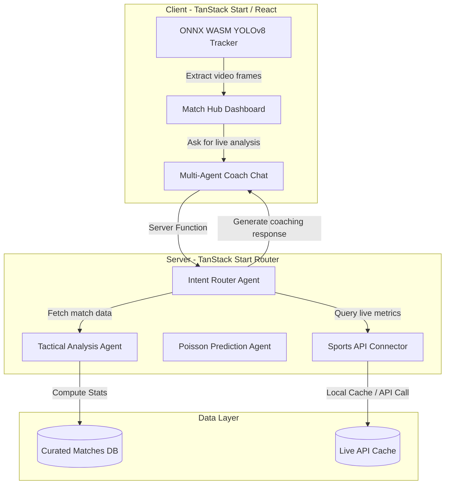

# ⚙️ Tactix AI : Explainable Multi-Agent Football Tactical Intelligence & Live Analytics Platform

**Tagline:** *Beyond Scores. Understand Football.*

An advanced, Multi-Agent Football Intelligence and Live Analytics platform built to demonstrate how Large Language Models (LLMs), Computer Vision (YOLO), and Retrieval-Augmented Generation (RAG) can revolutionize modern football coaching and tactical analysis.

Instead of relying on simple stat tables, Tactix AI utilizes an orchestration of specialized, autonomous AI agents to parse match event logs, run Poisson-based predictions, compute pressing intensity (PPDA), and generate explainable coaching analysis—grounded in real events. Additionally, it integrates browser-based computer vision (ONNX Runtime WASM) to process video uploads, tracking player coordinates to map tactical passing networks locally.

Designed with a premium, warm cream aesthetic (featuring atmospheric glassmorphism contrast), the platform offers a Live Fixture Feed, interactive Analyst Dashboards, Tactical Timelines, live xG maps, and a multi-agent chat assistant.


---

🌐 **Live Demo :** 

--- 

## Problem Statement ❓

Football analysis is often generic and stats-heavy. Fans and coaches receive basic statistics (e.g. possession, shots) but miss the *explainable tactical rationale* (e.g., why a specific passing lane failed, how a team's press was broken, or what tactical adjustments should be made at half-time). Traditional video-tracking solutions also require expensive server-side GPUs.

Current football applications primarily provide :
*   Live scores
*   Basic statistics (e.g., possession %, shots)
*   League standings
*   News and player ratings

However, they rarely explain :
*   **Why** one team is dominating.
*   Which **tactical adjustments** changed the game.
*   Which **player movements** created scoring opportunities.
*   How **formations evolved** during the match.
*   What **strategic changes** could improve team performance.

TACTIX AI bridges this gap by combining AI reasoning with football analytics.

---

## 🎯 Vision
Create an AI platform capable of analyzing football matches similarly to a professional tactical analyst. 

Instead of displaying :
> **England 2 – 1 Belgium**

TACTIX AI explains :
> *"England's high pressing strategy after halftime increased recoveries in the opponent's half by 37%. Belgium struggled to defend wide overloads, resulting in three high-quality chances from the left channel."*

---

## Project Objective ✨
Design and develop a web-based AI-powered football intelligence console capable of providing deep, explainable match analytics and live event-based coaching insights using specialized multi-agent routing.

Unlike standard sports applications, this system shows :
*   **Tactical Commentary** : Provide AI-generated tactical explanations during live matches & Understand live event logs and calculate tactical stats (xG, PPDA, territory).
*   **Video Coaching** : Analyze uploaded football videos and generate coaching reports.
*   **Momentum & Prediction** : Predict momentum shifts and match outcomes.
*   **Explainable AI** : Explain every prediction using football reasoning rather than black-box AI.
*   **Multi-Agent Design** : Build a scalable multi-agent architecture for sports intelligence (Tactical, Prediction, Live Data, RAG, Visuals).
*   Run client-side computer vision (YOLOv8) inside the browser to track player coordinates on video clips.
*   Incorporate proprietary coaching books (RAG) to recommend set-piece playbooks and neutralizing setups.
*   Offer an interactive chat console with real-time sports feed updates.

---

## 📸 Screenshots

### Platform Dashboard Interface


### Multi-Agent Console


### Match Hub & Schedule


### Tactical Analytics & Heatmaps


### Computer Vision Video tracking


---

## 🌟 Features

### 🤖 Multi-Agent Orchestration
*   Separate specialized sub-agents handle Intent Routing, Tactical Reports, Next-Goal Predictions, Live Events, RAG database queries, and SVG Visualizations.
*   Divided cognitive labor prevents hallucination and guarantees rigorous fact-grounding.
*   Automatic fail-fast streams falling back to high-fidelity local playbooks in case of API rate-limits.

### ⚽ Live Match Tracker & Sports API
*   Fetches real-time scores, minutes, and event logs from **API-Football** and **football-data.org**.
*   Overwrites fallback stubs with real-time match results instantly.
*   Instructs the AI to invoke live polling tools every 60 seconds during live games.

### 📚 RAG Tactical Playbook
*   Uses Vector Embeddings to retrieve set-piece manuals, team shape guidelines, and historical head-to-head metrics.
*   Enables coaches to generate detailed neutralization plans for elite opponents using the chat.

### 👁️ Client-Side Computer Vision (ONNX)
*   Runs YOLOv8 locally inside the browser using **onnxruntime-web** (WASM runtime).
*   Tracks players and overlays tactical trajectories on uploaded `.mp4` video clips without uploading heavy video data to external servers.

### 📊 Atmospheric Modern Cream UI
*   A stunning, premium layout crafted with a custom cream visual theme.
*   Features interactive SVG pass networks, rolling momentum charts, and live match event feeds.

---

## 🤖 Multi-Agent AI Architecture
TACTIX AI operates as a collaborative, multi-agent AI system where specialized agents cooperate via a central coordinator:

*   **Live Data Agent** : Collects live football data, synchronizes APIs, and detects match events.
*   **Tactical Analysis Agent** : Identifies formations, pressing intensity, and territorial dominance.
*   **Prediction Agent** : Calculates Poisson-bivariate win probabilities and next goal indicators.
*   **Video Analysis Agent** : Samples frames from video footage and uses vision models to identify team kits, shapes, positions, and registries.
*   **LLM Coach Agent** : Acts as the central coordinator, translating numerical telemetry and structured reports into clean football prose.
*   **RAG Agent** : Retrieves contextual articles and historical records from the vector knowledge base.
*   **Visualization Agent** : Translates data specs into interactive SVG/D3 charts (heatmaps, pass networks, and pitch views).

---

## 👥 Target Users
*   Football fans looking for deeper analytical understanding.
*   Amateur and professional coaches looking for automated reports.
*   Sports analysts and content creators looking for key takeaways.
*   Fantasy football players and students learning football tactics.
*   Sports media organizations.

---

## 🧠 How It Works

```text
User Match Query / Coach Prompt
            ↓
TanStack Start Server Route
            ↓
LLM Intent Router Agent
            ↓
┌───────────────────────┼────────────────────────┐
↓                       ↓                        ↓
Tactical Report   Poisson Prediction       RAG playbooks
(xG / PPDA)       (Bivariate outcome)      (Vector DB Search)
└───────────────────────┬────────────────────────┘
                        ↓
             Resolution Synthesizer
                        ↓
           Interactive SVG Analytics
         & Streamed Coaching Responses
```

---

## 🏛️ System Architecture Workflow



---

## 📦 Major Modules

### 1. Live Match Intelligence Dashboard
Displays real-time match information enhanced with AI-generated insights.
*   Live score, match timeline, possession, and dangerous attack feeds.
*   Expected Goals (xG) shot map and interactive momentum graphs.
*   Win probability / next goal probability.
*   AI-generated tactical commentary.

### 2. AI Coach
Users can upload match recordings, highlight videos, or training sessions. The AI automatically produces:
*   Team formation detection.
*   Tactical strengths & weaknesses.
*   Defensive errors and attacking patterns.
*   Passing analysis & player performance ratings.
*   Coaching recommendations (e.g., *"Introduce a double pivot to improve defensive stability"*).

### 3. Tactical Intelligence
Provides advanced football analytics and interactive visualizations:
*   **Player Heatmaps**: Positional density maps for every player.
*   **Pass Networks**: Passing links showing connection strength and average player positions.
*   **Pressing Traps**: Highlights pressing intensity, PPDA, and turnover zones on the pitch.
*   **Scouting Notes**: Interactive reports showing player-by-player statistics and observations.

### 4. Match Simulator
A "What if?" tactical simulator. Users can modify match levers:
*   Substitutions (adding an early impact sub).
*   Red card removals/additions.
*   Formation changes (e.g., 4-3-3 vs 3-5-2).
*   Low-block defense toggling.
*   Pressing intensity and tempo sliders.

The AI recalculates projected xG, win probability, territory dominance, and generates a structured narrative explaining the changes.

### 5. AI Football Chat Assistant
An LLM-powered football expert capable of answering contextual questions (e.g., *"Why is Spain struggling?"*, *"How does Portugal contain Yamal?"*). Unlike generic chatbots, the responses are grounded in:
*   Live match data.
*   Curated tactical documents.
*   Historical World Cup archives.
*   Team statistics and competition history.

### 6. Historical Intelligence & Player Ratings
Compare teams across tournaments, analyze tactical evolution, and view explainable player ratings (detailing specific reasons like duels won, xG generated, key chances created, passing accuracy, and distance covered instead of simple numerical grades).

---

## 🛠 AI & CV Technologies
*   **Large Language Models (LLMs)** : Google Gemini (`gemini-3-flash-preview` and `gemini-2.5-flash`) via the Vercel AI SDK.
*   **Retrieval-Augmented Generation (RAG)** : Contextual vector lookup for football rules and tournament histories.
*   **Computer Vision (CV)** : Frame-based player tracking and box estimation via LLM Vision APIs.
*   **In-Browser YOLO & Tracking** : Lightweight object detection (YOLOv8/YOLOv10) and IoU tracking running client-side.

---

## 🛠️ Technologies Used

*   **Database & Static Models :** Curated World Cup 2026 data models, SQLite cache
*   **AI Models :** Google Gemini Pro (Agent Reasoning), Gemini Text Embeddings
*   **Sports APIs :** api-sports.io (API-Football) and football-data.org (Gateway & Cache)

### Frontend & Rendering
*   **Framework** : React + Vite + TanStack Start (file-based routing, SSR, and server functions).
*   **Styling** : Tailwind CSS + Vanilla CSS (Atmospheric Cream design system)
*   **Charts** : Recharts / SVG visualizations.
*   **WASM runtime** : `onnxruntime-web` for client-side YOLO execution.

### Backend & AI
*   **API & Serverless** : TanStack Start Server Functions / Nitro.
*   **AI Gateway** : Centralized AI Provider Gateway Integration.
*   **Frameworks** : Vercel AI SDK (`ai` and `@ai-sdk/openai-compatible`).

---

## 📂 Project Structure

```text
Tactics-Ai/
│
├── src/
│   ├── components/
│   │   └── tactix/          ← UI: AgentConsole, LiveFootballFeed, ChatAssistant
│   │
│   ├── routes/
│   │   ├── api/             ← Server routes: chat, commentary, live-fixtures
│   │   ├── index.tsx        ← Match Hub main page
│   │   └── fixture.$id.tsx  ← Match Analytics Detail page
│   │
│   └── lib/
│       ├── agents/          ← Cognitive Engine: prediction, tactical, rag, live-data
│       ├── match-data.ts    ← Base static stubs and flag mapper
│       └── wc2026-schedule  ← Fallback curated schedule
│
├── public/                  ← YOLO model WASM files, favicon.svg
├── package.json
└── tsconfig.json
```

---

## 🚀 Step-by-Step Installation Guide

Follow these instructions exactly to get the project running on your local machine.

### Step 1: Prerequisites
Ensure you have the following installed on your system:
*   **Node.js** (v18.x or higher)
*   **Git**

### Step 2: Clone the Repository
```bash
git clone <your-github-repo-url>
cd tactics-ai
```

### Step 3: Install Dependencies
```bash
npm install
```

### Step 4: Environment Configuration
Create a file named `.env` in the root folder of the project. Add the following lines:
```env
# Google Gemini API Key
GEMINI_API_KEY="your_actual_gemini_api_key"

# Sports API Keys (API-Football / Football-Data)
FOOTBALL_API_KEY="your_football_api_key_here"
FOOTBALL_DATA_API_KEY="your_football_data_key_here"
```

### Step 5: Start the Application
Start the development server:
```bash
npm run dev
```
Open your web browser and navigate to `http://localhost:8080`.

---

## 🔍 How to Test the Application

1.  **Test Live Scores & Penalty Shootout :-**
    *   *Action :* Load the homepage. Scroll to the "Live Feed" section.
    *   *Expected Result :* You will see actual, completed results (like Switzerland beating Colombia `0-0 (4-3 Pens)` on penalties, or England's win featuring a red card).

2.  **Test Coach AI RAG Query :-**
    *   *Action :* Go to the Coach Chat Console and type: "How do we stop Morocco's transitions?"
    *   *Expected Result :* The system classifies the intent, queries Morocco's profile, and generates a concrete tactical plan citing exact defensive coverage channels.

---

## 👤 Author

**Name**: ALVIRA PARVEEN  
🔗 [LinkedIn](https://www.linkedin.com/in/alvira-parveen-78022536b)  
🌐 [GitHub](https://github.com/Alvira-Parveen)

---

## 📄 License

This project is licensed under the MIT License — see the [LICENSE](LICENSE) file for details.
